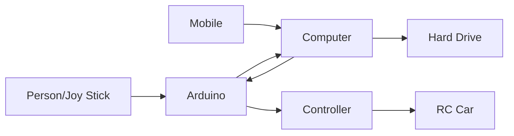
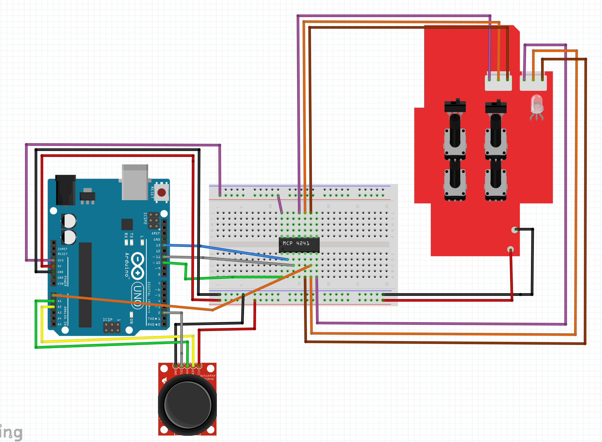
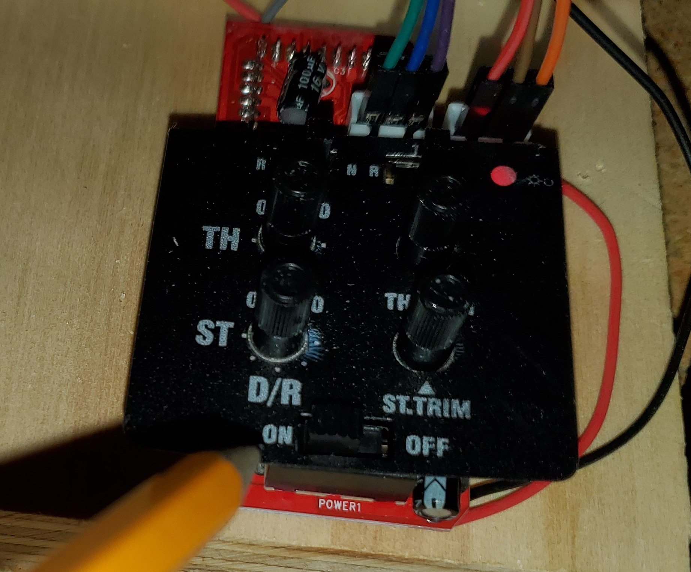
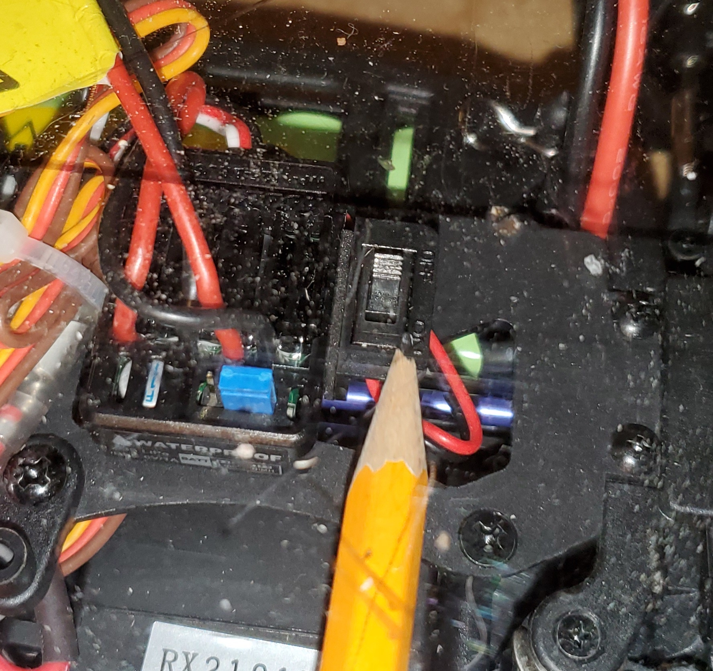
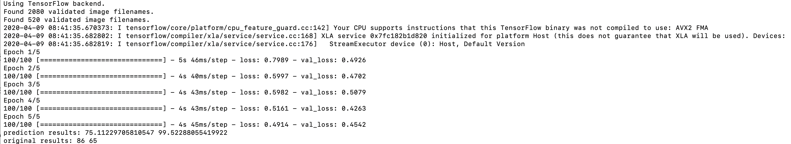

# T-Rover

T-Rover is a self-driving RC car with optional virtual reality based driving!

Have you ever wondered how self-driving cars work? Build your own with the IoT-Mobile kit and these instructions.

This repo contains data from a live capture session and also a pre-trained ML model.  You can use these to perform some basic validation of steps if you do not currently have a T-Rover RC completed.

## Overall Design



Current steps are for Android devices.  Adaptation to iOS is possible.
## Electronics Overview

The design overview is in [Fritzing](https://fritzing.org/home/).  


## Setup Environment

### Install conda using either of the two options

https://docs.conda.io/en/latest/index.html
Or
https://www.anaconda.com/distribution/

### Install Arduino IDE
https://www.arduino.cc/en/main/software

### Install IP WebCam from the Google Play Store

You can use another mjpeg server, on your mobile device.  For now, we've only tested on an Android device using IP WebCam.

https://play.google.com/store/apps/details?id=com.pas.webcam&hl=en_US


## Setup your environment
### Create a new python 3.6 environment.  
```
>conda create -n t-rover python=3.6
```
### Activate the enivronment
``` 
>conda activate t-rover
```
### Install dependencies
``` 
>pip install -r requirements.txt
```

At this point, your python environment should be ready for ML.

## Receive Input from the Joystick and IP Webcam

In this step you will read data from the joystick and webcam, then correlate them together. Later this data will be used to train a machine learning model to self-drive the car!

### Edit _1_capture_data.py_ with your specific port information.  
From the previous step, use edit arduino_port variable with your specific port information.

` 
arduino_port = '/dev/cu.wchusbserial1440'
`

Turn on the rc transmitter




* Turn on the rc car



* At the command prompt run the script
```
>python 1_capture_data.py
```

* Drive the car around a track for 5 laps.  The better you drive around the track, the better the model will be able to infer the correct actions.

* Press CTRL-C to stop the capture data 

Any time the throttle goes above a certain threshold, the data will be recorded.  This value (X_TOL_MIN) can be adjusted in the above python script to change this threshold.  Data is not recorded when car is not moving forward above this threshold.  Data is not recorded when the car is moving backwards.


## Train a Machine Learning Model

That's right, you're going to train a Machine Learning model _before_ you can
drive the car. When a Machine Learning misbehaves, it can be difficult to
troubleshoot. That's why we suggest that you train your first model based on
our existing dataset _first_. By using our dataset, we already know exactly how
the trained model should behave and that makes it easier to figure out what's
wrong if your model doesn't work right away.

You will be using the data from the previous step.  Both the image files and control files are stored in your *./data* directory.  The python script takes the images and control information, and reformats it into a structure tensorflow needs to create the model.  The original image is 320x240 pixel.  It is recommended to lower the resolution to 160x120 or 100x75.  The lower the resolution, the faster your model is created.  However, the lower the resolution, the less accurate it can become.  With machine learning, you will need to do some trial and error to optimize your model.  The final model will be saved under the *./models* directory.

At the command prompt run the script
```
>python 2_train_model.py
```
The output should be similar to the below.



As a general guideline, the lower the loss and val_loss, the better the model will be.  The program will stop executing after it is finished.

## Control the Car

Turn on the devices:
* Plug the arduino into the computer
* Start the IP WebCam app
* Turn on power to the RC car
* Turn on the RC transmitter 

At the command prompt run the script
```
>python 3_serve_model.py
```

As soon as you turn on the RC transmitter, it will start driving based on the inference of the image it sees.  

Press CTRL-C to stop 
