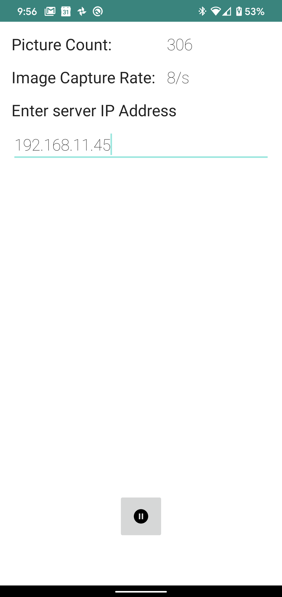

# trover - Android Image Capture client program and Nodejs server

trover in this directory has a complete Android program for capturing images from the camera and sending those images via http to a server. Trover_server contains all the code to receive said images and save them to a directory structure. trover_server is a very simple program written using nodejs and will run pretty much anywhere.  I have it running on a mac and raspberry pi zero.   

To compile and change the Android program you will need Android Studio from here:

https://developer.android.com/studio/index.html

## Install
You will need nodejs installed for the server side. Node is easy and will run on various cloud sevices.

https://nodejs.org/en/docs/

Installing an apk:

$ adb install trover_client-v1\(1.0\)-debug.apk

You may have to use the -t or -f depending on your setup.

$ adb install -t trover_client-v1\(1.0\)-debug.apk

Look here for help.

https://adbshell.com/commands/adb-install

## Image Capture
trover and trover_server are designed to work on a local wifi network and does not support https at the moment.  I shared a wifi network on my device to connect trover with trover_server.  Start trover_server by running the following command from the "t-rover/android/trover_server/trover" directory.  

TMC02V64RDHTD5:trover tmoapploan$ bin/www
20 Mar 09:03:50 - ImageCapturesServer available.

You should see the line above print out.  

TMC02V64RDHTD5:TMOAndroidApp tmoapploan$ ifconfig
lo0: flags=8049<UP,LOOPBACK,RUNNING,MULTICAST> mtu 16384
	options=1203<RXCSUM,TXCSUM,TXSTATUS,SW_TIMESTAMP>
	inet 127.0.0.1 netmask 0xff000000 
	inet6 ::1 prefixlen 128 
	inet6 fe80::1%lo0 prefixlen 64 scopeid 0x1 
	nd6 options=201<PERFORMNUD,DAD>
gif0: flags=8010<POINTOPOINT,MULTICAST> mtu 1280
stf0: flags=0<> mtu 1280
XHC20: flags=0<> mtu 0
XHC1: flags=0<> mtu 0
XHC0: flags=0<> mtu 0
en0: flags=8863<UP,BROADCAST,SMART,RUNNING,SIMPLEX,MULTICAST> mtu 1500
	ether 8c:85:90:20:e6:14 
	inet6 fe80::f1:6830:7070:c495%en0 prefixlen 64 secured scopeid 0x8 
	inet 192.168.11.61 netmask 0xffffff00 broadcast 192.168.11.255
	nd6 options=201<PERFORMNUD,DAD>
	media: autoselect
	status: active

Install the Android app via adb or Android Studio. Start the Android app.  On your local network determine the IP address of the server.  I use ifconfig on the server machine. Example ifconfig output below shows that my server is using IP address 192.168.11.61.  Enter the IP address into the only editable field in the app. Pressing the play button near the bottom of the screen will start image capture.  You should see output from trover_server showing downloads.

## Images
Once you have everything working images are stored in "t-rover/android/trover_server/trover/public/images". This is the current state of things and may need some work.  The original intent of this system was to catch people breaking into cars.  Images were captured when the accelerometer detected movement. The directory structure may need to change for machine learning.

## Trouble Shooting

1. Always check network.
2. adb logcat shows logs from Android. If you see network connection exceptions then there is a problem.
3. Ask me. :-)

## Caveats
Sorry, but I don't have the time to put a lot of time into this project so you may have to struggle. Struggle ~= life long knowledge. I will try to improve documentation after enough complaints.  Updating code is fun updating docs well... you know.

Best Regards,
David Moffett
